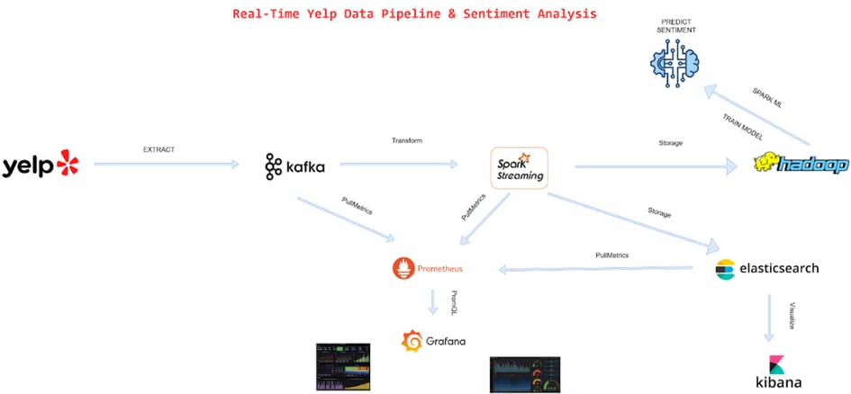

# REAL-TIME YELP BIG DATA PIPELINE & SENTIMENT ANALYSIS SYSTEM

## 1. Giới thiệu chung

Trong bối cảnh dữ liệu lớn (Big Data) ngày càng đóng vai trò quan trọng trong các hệ thống thương mại điện tử và mạng xã hội, việc xây dựng một hệ thống có khả năng **thu thập – xử lý – phân tích – lưu trữ – trực quan hóa dữ liệu ở quy mô lớn và gần thời gian thực** là yêu cầu thiết yếu.

Dự án này xây dựng một **Big Data Pipeline hoàn chỉnh** dựa trên tập dữ liệu Yelp, mô phỏng hệ thống phân tích đánh giá người dùng (reviews) trong thực tế, sử dụng các công nghệ phổ biến trong doanh nghiệp như:

- Apache Kafka
- Apache Spark (Structured Streaming)
- Hadoop HDFS
- Elasticsearch & Kibana
- Spark MLlib
- Prometheus & Grafana

Hệ thống cho phép:
- Xử lý dữ liệu **streaming + batch**
- Phân tích hành vi người dùng theo thời gian
- Thực hiện **Sentiment Analysis** trên dữ liệu lớn
- Lưu trữ dữ liệu lịch sử để huấn luyện mô hình Machine Learning
- Trực quan hóa kết quả và giám sát hiệu năng hệ thống

---

## 2. Mục tiêu dự án

### 2.1. Mục tiêu tổng quát
Xây dựng một hệ thống Big Data mô phỏng thực tế, đáp ứng đầy đủ 3V:
- **Volume**: dữ liệu lớn (hàng triệu reviews)
- **Velocity**: xử lý gần thời gian thực
- **Variety**: dữ liệu bán cấu trúc (JSON)

### 2.2. Mục tiêu cụ thể
- Thiết kế pipeline ingestion sử dụng Kafka
- Xử lý streaming bằng Spark Structured Streaming
- Lưu trữ dữ liệu dài hạn trên HDFS
- Huấn luyện mô hình sentiment bằng Spark ML
- Phân tích thống kê và xu hướng người dùng
- Trực quan hóa dữ liệu bằng Kibana
- Monitoring hệ thống bằng Prometheus & Grafana

---

## 3. Kiến trúc hệ thống

### 3.1. Tổng quan kiến trúc


### 3.2. Mô tả các thành phần

#### Apache Kafka
- Đóng vai trò **message broker**
- Nhận dữ liệu review từ producer
- Đảm bảo khả năng mở rộng và chống mất dữ liệu

#### Apache Spark Structured Streaming
- Xử lý dữ liệu theo micro-batch
- Làm sạch dữ liệu, chuẩn hóa văn bản
- Thực hiện aggregation theo thời gian (window)
- Gọi mô hình ML để dự đoán sentiment

#### Hadoop HDFS
- Lưu trữ dữ liệu lịch sử
- Định dạng Parquet để tối ưu truy vấn
- Là nguồn dữ liệu huấn luyện mô hình

#### Elasticsearch & Kibana
- Elasticsearch: index dữ liệu để search nhanh
- Kibana: xây dựng dashboard phân tích

#### Prometheus & Grafana
- Thu thập metrics từ Kafka & Spark
- Theo dõi độ trễ, throughput, resource usage

---
## 3.3. Kiến trúc triển khai trên Kubernetes

Thay vì triển khai hệ thống theo mô hình monolithic hoặc Docker đơn lẻ, dự án này được triển khai trên **Kubernetes (K8s)** nhằm mô phỏng môi trường **production-grade** thường được sử dụng trong doanh nghiệp.

Kubernetes đóng vai trò:
- Điều phối container (container orchestration)
- Tự động scale các service
- Quản lý tài nguyên CPU / RAM
- Tăng tính sẵn sàng và khả năng phục hồi hệ thống

### Kiến trúc triển khai
```
+---------------- Kubernetes Cluster ----------------+
| |
| +-----------+ +-----------+ |
| | Kafka |<---->| Zookeeper| |
| | Pod(s) | | Pod | |
| +-----------+ +-----------+ |
| | |
| v |
| +------------------+ |
| | Spark Streaming | |
| | Driver + Executor| |
| +------------------+ |
| | |
| v |
| +-----------+ +----------------+ |
| | HDFS |<---->| Elasticsearch | |
| | Name/Data | | Pod(s) | |
| +-----------+ +----------------+ |
| | |
| v |
| +------------------+ |
| | Kibana / Grafana | |
| +------------------+ |
| |
+----------------------------------------------------+
```
## 4. Dataset Yelp

### 4.1. Nguồn dữ liệu
- Yelp Open Dataset (Kaggle)

### 4.2. Định dạng dữ liệu
- JSON (semi-structured)

### 4.3. Các file chính
| File | Mô tả |
|-----|------|
| review.json | Nội dung đánh giá |
| business.json | Thông tin doanh nghiệp |
| user.json | Thông tin người dùng |

### 4.4. Một số trường quan trọng
- `review_id`
- `business_id`
- `user_id`
- `stars`
- `text`
- `date`
- `useful`, `funny`, `cool`

---

## 5. Cấu trúc thư mục dự án

```
BIGDATA-2025-1/
│
├── data/
│ ├── review.json
│ ├── business.json
│ └── user.json
│
├── kafka/
│ └── producer.py
│
├── Spark/
│ ├── main.py
│ ├── analytics_yelp.py
│ ├── train_nlp.py
│ ├── pipeline_orchestration.py
│ └── configuration.py
│
├── models/
│ └── sentiment_model/
│
├── hdfs/
├── ElasticSearch/
│
├── web/
│ ├── web.py
│ ├── templates/
│ └── static/
│
├── docker-compose.yml
├── Dockerfile
├── requirements.txt
└── README.md
```

---

## 6. Quy trình xử lý dữ liệu

### 6.1. Ingestion
- Đọc file JSON lớn
- Producer gửi từng record vào Kafka
- Điều chỉnh tốc độ gửi để mô phỏng realtime

### 6.2. Streaming Processing
- Spark đọc dữ liệu từ Kafka
- Parse JSON schema
- Làm sạch text (lowercase, remove punctuation)
- Gán timestamp
- Window aggregation theo phút/giờ/ngày

### 6.3. Storage
- Ghi dữ liệu vào HDFS dưới dạng Parquet
- Index dữ liệu quan trọng vào Elasticsearch

### 6.4. Batch Processing
- Đọc dữ liệu lịch sử từ HDFS
- Tổng hợp thống kê
- Huấn luyện mô hình sentiment

---

## 7. Phân tích dữ liệu & các hàm chính

### 7.1. Top doanh nghiệp được đánh giá nhiều nhất
- Đếm số review theo business
- Xử lý skew bằng salting

### 7.2. Doanh nghiệp có nhiều danh mục nhất
- Explode categories
- Group by business

### 7.3. Doanh nghiệp có đánh giá cao nhất
- Lọc theo số review tối thiểu
- Tính trung bình sao

### 7.4. Phân tích sentiment
- Positive: stars ≥ 4
- Neutral: stars = 3
- Negative: stars ≤ 2

### 7.5. Phân tích giờ cao điểm
- Group by hour / day / month
- Phục vụ tối ưu scale hệ thống

---

## 8. Machine Learning – Sentiment Analysis

### 8.1. Pipeline huấn luyện
- Tokenizer
- StopWordsRemover
- TF-IDF
- Logistic Regression / Naive Bayes

### 8.2. Lưu mô hình
- Lưu trên HDFS / local
- Versioning model

### 8.3. Dự đoán realtime
- Load model vào Spark Streaming
- Gán sentiment cho từng review mới

---

## 9. Trực quan hóa dữ liệu

### 9.1. Kibana Dashboard
- Line chart: số lượng review theo thời gian
- Pie chart: phân bố sentiment
- Bar chart: top doanh nghiệp
- Filter theo city, business

### 9.2. Grafana Monitoring
- Kafka consumer lag
- Spark processing latency
- CPU & RAM usage

---

## 10. Web Demo (Flask)

- REST API nhập nội dung review
- Trả về sentiment dự đoán
- Demo khả năng deploy mô hình

---


## 11. Các thành phần triển khai trên Kubernetes

### 11.1. Apache Kafka trên Kubernetes
- Kafka được triển khai dưới dạng **StatefulSet**
- Zookeeper chạy riêng biệt để quản lý metadata
- Kafka sử dụng **PersistentVolumeClaim (PVC)** để đảm bảo dữ liệu không bị mất khi pod restart

Vai trò:
- Nhận dữ liệu review từ producer
- Buffer dữ liệu cho Spark Streaming
- Đảm bảo độ bền dữ liệu (durability)

---

### 11.2. Spark Structured Streaming trên Kubernetes

Spark được triển khai theo mô hình:
- **Spark Driver**: chạy trong một Pod
- **Spark Executors**: được Kubernetes tự động tạo theo resource request

Ưu điểm:
- Tự động scale executor
- Quản lý tài nguyên chặt chẽ
- Phù hợp xử lý streaming workload lớn

Spark thực hiện:
- Đọc dữ liệu từ Kafka
- Parse & xử lý dữ liệu
- Gọi mô hình ML dự đoán sentiment
- Ghi kết quả ra HDFS và Elasticsearch

---

### 11.3. Hadoop HDFS trên Kubernetes

HDFS được triển khai gồm:
- **NameNode** (Deployment)
- **DataNode** (StatefulSet)

Mỗi DataNode gắn với một PVC để:
- Lưu trữ dữ liệu Parquet lâu dài
- Làm data lake cho batch processing & ML training

HDFS đóng vai trò:
- Kho lưu trữ dữ liệu lịch sử
- Nguồn dữ liệu cho huấn luyện mô hình ML

---

### 11.4. Elasticsearch & Kibana

- Elasticsearch chạy dưới dạng Deployment
- Kibana kết nối trực tiếp tới Elasticsearch service
- Dữ liệu sentiment và thống kê được index để phục vụ visualization

Dashboard Kibana:
- Review theo thời gian
- Phân bố sentiment
- Top business / city
- Filter realtime

---

### 11.5. Prometheus & Grafana (Monitoring)

Prometheus thu thập metrics từ:
- Kafka
- Spark
- Kubernetes node
- Pod resource usage

Grafana hiển thị:
- CPU / RAM usage
- Kafka consumer lag
- Spark processing latency
- Throughput streaming

---

## 12. Quản lý tài nguyên & Scaling

### 12.1. Resource Request & Limit

Mỗi Pod được cấu hình:
- `requests.cpu`
- `requests.memory`
- `limits.cpu`
- `limits.memory`

Ví dụ:
- Kafka: RAM cao, CPU trung bình
- Spark Executor: CPU cao, RAM tùy batch size
- Elasticsearch: RAM lớn để cache index

---

### 12.2. Horizontal Scaling

- Kafka có thể scale bằng cách tăng partition
- Spark executor scale tự động
- Elasticsearch scale bằng cách tăng replica

Kubernetes giúp hệ thống:
- Chịu tải tốt hơn
- Không bị gián đoạn khi workload tăng

---

## 13. Lưu trữ dữ liệu trong Kubernetes

### 13.1. Persistent Volume (PV) & PVC

Dự án sử dụng PVC cho:
- Kafka log
- HDFS data
- Elasticsearch index

Điều này đảm bảo:
- Dữ liệu không mất khi pod bị restart
- Phù hợp với hệ thống Big Data thực tế

---

## 14. Quy trình triển khai hệ thống

### 14.1. Khởi tạo cluster

```bash
minikube start --memory=16384 --cpus=6
```
### 14.2. Deploy các service
```
kubectl apply -f k8s/zookeeper.yaml
kubectl apply -f k8s/kafka.yaml
kubectl apply -f k8s/hdfs.yaml
kubectl apply -f k8s/spark.yaml
kubectl apply -f k8s/elasticsearch.yaml
kubectl apply -f k8s/kibana.yaml
kubectl apply -f k8s/prometheus.yaml
kubectl apply -f k8s/grafana.yaml
```
### 14.3. Kiểm tra trạng thái
```
kubectl get pods
kubectl get svc
```
## 15. Đánh giá & hạn chế
### Ưu điểm

- Kiến trúc rõ ràng, thực tế

- Áp dụng nhiều công nghệ Big Data

- Có cả streaming & batch

- Có ML & monitoring

### Hạn chế

- Dataset offline (giả lập realtime)

- Chưa dùng deep learning (BERT)

- Cluster nhỏ, mục đích học thuật

## 16. Hướng phát triển

- Thay TF-IDF bằng BERT

- Online learning

- Deploy trên Kubernetes

- Multi-topic Kafka

- Recommendation System

## 17. Kết luận

Dự án đã xây dựng thành công một hệ thống Big Data hoàn chỉnh, mô phỏng quy trình phân tích dữ liệu lớn trong thực tế, đáp ứng yêu cầu xử lý realtime, lưu trữ, phân tích và trực quan hóa dữ liệu, phù hợp cho đồ án Big Data, Data Engineering và Machine Learning.

## 18. Tác giả
Nhóm 1
Big Data & Yelp sentiment Project – 2025